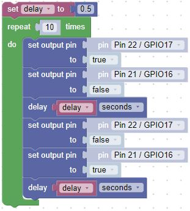
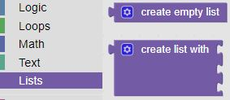
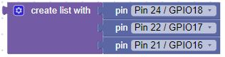
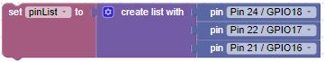
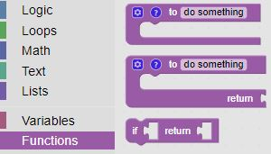
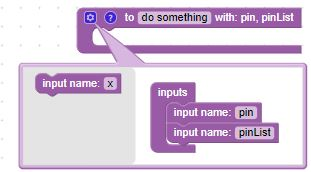
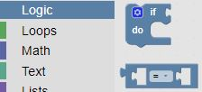
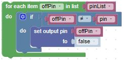
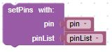

# Our Second Lab: Using the Output Blocks to Make LEDs Blink

1. The longer lead on an LED is the Anode(+) lead.  This is the lead that you will connect to your Pico. Let's start with two LEDs

    ```Insert the Anode leads into j20 and j19```

1. The shorter lead on an LED is called the Cathode(-).  This is the lead that you will connect to the ground rail.

    ```Insert the Cathode leads into the Ground(-) rail```

1. We will also use a resistor from one of the ground pins on the Pico and connect it to the ground rail.

    ```Insert the resistor leads into j3 and into the Ground(-) rail``` 

1. When you are finished, your breadboard should look similar to the image below (Note: your LEDs may be different colors)


## How Would You Make the LEDs Blink in an Alternating Pattern?

The object of this lab is to have one of the external LEDs on while the other is off.  Then switch after a half second.  Continue ten times.

- We can modify the first program to use two sets of output pin blocks to control the external LEDs.  

- Hints: 
    - Look at the Raspberry Pi Pico diagram and find the pins connected to ```J20 and J19```.
    - Add a second set of output pin blocks.
    - Change the pin in the output pin block to select the correct pins.
    - Start with one pin on (true) and the other off (false)



!!! Challenge
    Can you add more LEDs and have one LED on a time?  Ideally, each LED would be on for 1/2 second while the rest were off, then the next LED would turn on, and so on.
    
    Here are some ideas:

    - Use a list block and a variable block to hold the pins (Pin24, Pin22, Pin 21, ...)

    

    - Use a loop to determine which LED to turn on (rename the loop variable to pin for clarity)

    

    - Use a function (let's call it setPins) to turn on one LED while turning the others off

    

    - We'll need some logic to determine which pin to leave on while the other pins are turned off.  This will require another loop block and a Logic block

    

    - Finally, we'll need to call the function

    

    - Can you put together the pieces?
