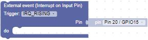
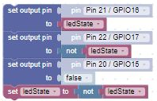
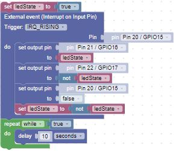

# Our Third Lab: Reading a Button Press (Interrupt)

1. Using the setup from the last lab, we'll use two LEDs and a resistor. As a reminder:

    ```Insert the Anode (long) leads into j20 and j19```

    ```Insert the Cathode (short) leads into the Ground(-) rail```

    ```Insert the resistor leads into j3 and into the Ground(-) rail``` 

1. We'll also use a micro button inserted in the bottom of the board.  As a reminder:

    - The pins of the switch will straddle the channel and be inserted into ```e28, e30, f28, and f30```

    - Using one of the jumper wires, insert one end to ```j5``` and the other end into the ```Power(+) rail``` 

    - Take the second jumper wire, insert one end into the ```Power(+) rail``` and the other into ```j28```

    - Using the third jumper wire, insert one end into ```a30``` and the other end into ```a20```

    - When you are finished, your breadboard should look similar to the image below (Note: your LEDs and wires may be different colors)


## What is an Interrupt and Why Would You Use It?

- Although the polling version is simple, it does take a lot of the processor resources. The button.value() is checked multiple times a second, even though the button might only be pressed once a day.

- A more efficient strategy is to use an interrupt handler. This is a function that is “registered” by MicroPython to handle external events such as button pushes.

- Think of it like this: instead of checking your phone every 10 seconds, waiting for a text from your friend, your phone vibrates to let you know you have a text.

## Using an Interrupt Handler Block

- An interrupt handler has two parts:

    - The first part is finding the External event (Interrupt on Input Pin) Machine In/Out Pins block and moving it to the canvas.

        - We will continue to use Pin 20 as the Pin for the interrupt

        - Change the Trigger to  IRQ_RISING.  This indicates that the the interrupt will happen when the button is pressed.

            

    - The second part is determining what should happen when the interrupt is triggered.  As in the previous lab, we want to turn on one led and turn off the other one.

        

## Tying it all together

- Our solution needs one more piece.  Since the microprocessor is waiting for an interrupt to happen, we'll add a while Loop block with a delay Timing block.  This will ensure that our blocks will continue to execute while they wait for a button press.

    

!!! Challenge

    Can you add more LEDs, just as you did in the previous lab?

    Here are some hints:

    - The pinList block, setPins function block, and setPins function calling block remain the same

    - Replace the polling block with the interrupt block

