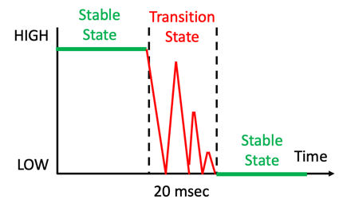
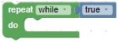
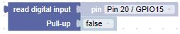
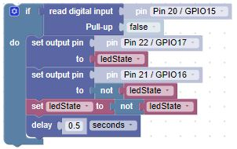
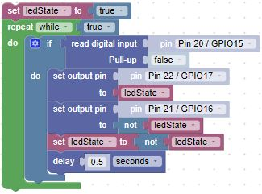

# Our Third Lab: Reading a Button Press (Polling)

1. Using the setup from the last lab, we'll use two LEDs and a resistor. As a reminder:

    ```Insert the Anode (long) leads into j20 and j19```

    ```Insert the Cathode (short) leads into the Ground(-) rail```

    ```Insert the resistor leads into j3 and into the Ground(-) rail``` 

1. Take a micro button and insert it into the bottom of the board.  The pins of the switch will straddle the channel and be inserted into ```e28, e30, f28, and f30```

1. Using one of the jumper wires, insert one end to ```j5``` and the other end into the ```Power(+) rail``` 

1. Take the second jumper wire, insert one end into the ```Power(+) rail``` and the other into ```j28```

1. Using the third jumper wire, insert one end into ```a30``` and the other end into ```a20```

1. When you are finished, your breadboard should look similar to the image below (Note: your LEDs and wires may be different colors)


## What Does a Button Press Look Like to the Microcontroller?



## How Would You Read the Button to Make the LEDs Blink in an Alternating Pattern?

The object of this lab is to have one of the LEDs on while the other is off.  Then switch after each button press.  Continue until you stop the program.

- We need to create the following blocks:

    - Add a variable for the current led state (set the state to a true Logic block).

    - Have the loop run forever using a while Loop block set to a true Logic block:

    
    
    - Have the microcontroller read a digital input.  To do so, we need to create a Machine In/Out Pins read digital input block for GPIO20, with the default state to be logical false (pulled down):

    

- When the button is pressed, logical true will be applied to the input.

- Test the value with an if Logic block

    - If the button is pressed, set the output pin blocks:
        - Set one block to the ledState Variable block
        - Set the other block using the Logical not block followed by the ledState Variable block
        - Update the value of the ledState Variable block to the Logical not block followed by the ledState Variable block 
        - Add a delay Timing block to get a clean button press

        


- Finally move the if blocks inside the while Loop block:

    

!!! Challenge 

    Can you add more LEDs, just as you did in the previous lab?

    Here are some hints:

    - Create a variable block to hold the number of the pin you want to turn on.
    
    - Use the in list list get # List block to get a specific pin for the function call.

    - Use the change variable by 1 Variable block each time the button is pressed.

    - Use a remainder Math block to ensure the number of the pin retrieved from the list doesn't exceed the number of pins in the list.

