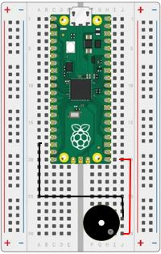

# Our Tenth Lab: Using a Buzzer to Play Music 

## Use a Piezo Buzzer (or equivalent)

1. Place the buzzer with the positive pin (marked with a plus sign) in  ```h30```
1. The other pin should line up into ```f28```
1. Using one of the jumper wires, insert one end to ```j30``` and the other end into ```j20```
1. Using another jumper wire, insert one end to ```j28``` and the other end into ```a18```

1. When you are finished, your breadboard should look similar to the image below (Note: your wires may be different colors)



## Working With Music

- We'll need to add two music libraries to our microcontroller.  This can be done through the Install rtttl library and Install songs library buttons in the Sounds secion:

    

- Now you can select a song or play a tone.

!!! Challenge

    - Play the Muppets Song

    - Followed by a 1200 Hz tone fo 5 seconds
     