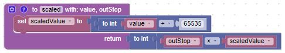

# Our Ninth Lab: Using a Joystick to Draw Lines on an OLED Display 

## Parts for this Lab are the OLED display and a Joystick

1. Using the setup from the last lab, we'll use the display.  As a reminder:

    - Insert the display into ```f25, f26, f27, and f28```
    - Using one of the jumper wires, insert one end to ```i25``` and the other end into ```i18```
    - Using another jumper wire, insert one end to ```j26``` and the other end into ```j5```
    - Using another jumper wire, insert one end to ```h27``` and the other end into ```b2```
    - Using another jumper wire, insert one end to ```i28``` and the other end into ```a1```

1. Using the wires attached to the joystick, connect them as follows:
    - The wire from **GND** on the joystick goes to ```i8```
    - The wire from **+5V** on the joystick goes to ```i6```
    - The wire from **VRX** on the joystick goes to ```i9```
    - The wire from **VRY** on the joystick goes to ```i10```
    - The wire from **SW** on the joystick goes to ```j20```

1. When you are finished, your breadboard should look similar to the image below (Note: your wires may be different colors)


## Drawing Lines With a Joystick and the OLED Display

- We already added the ssd1306 library to the microcontroller.

- We also took some time to look at the blocks in the Displays OLED Display section.

    - Did you notice the line block?

- We learned how to read the Analog to Digital Converter inputs in Lab 5.  In this case, we are using two of the ADCs.

- Additionally, we learned to read a button press in Lab 3.  We do not need to use the interrupt method (although we could)

!!! Challenge

    - Using what you learned in the previous labs, do the following:

        - Give the user instructions on how to operate the joystick to clear the screen

        - Wait for the user to press the joystick

        - Clear the screen

        - Read the voltages from the joystick 

        - Convert the voltages to a screen coordinate (X, Y)

        - Draw a line from the starting position to the new position

        - Continue until the user clears the screen

        - You will need this function to scale the voltage to a position

            
     
