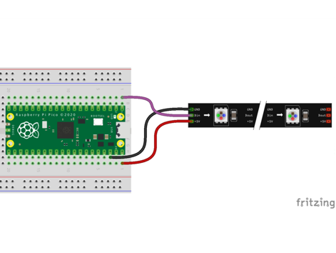

# Our Seventh Lab: Using a NeoPixel Display 

## Parts for this Lab:

1. We will use the neopixel display.

    - Insert the lead from **GND** of the display into ```j3```
    - Insert the lead from **VCC** of the display into ```j40```
    - Insert the lead from **IN** of the display into ```a1```

1. When you are finished, your breadboard should look similar to the image below (Note: your wires may be different colors)



## Working With the NeoPixel Display

- NeoPixels are Red-Green-Blue LEDs that are designed to makes them easy to control with three wires: GND, +5V and a single serial data line.

- Controlling NeoPixels is simple using BIPES.  We only need a few blocks to control the display.

    - First, we'll need the Init NeoPixel block from Displays NeoPixel Led Strip section

        

        Our NeoPixel display has 8 segments, and we connected it to Pin 1, so make sure to set the Pin and Number of LEDs correctly in the block.

    - Let's set all of the segments red:
    
        - We'll need two more blocks from the Displays NeoPixel Led Strip Section (Control NeoPixel and Write NeoPixel)

        

        - Now, with a count Loop block, we can set all of the segments

        


!!! Challenge

    Using a variety of colors, set the pixels, one at time to each color such that it appears that the display starts out with a single pixel lit in a color, then two pixels in the same color, etc. until all 8 are lit.  Then start on a second color lighting the first pixel.

    

    Colors can be found here: 
    [https://www.rapidtables.com/web/color/RGB_Color.html](https://www.rapidtables.com/web/color/RGB_Color.html)

    Once that works, turn the entire set of pixels on with a single color, then move to the next color that you selected.

     