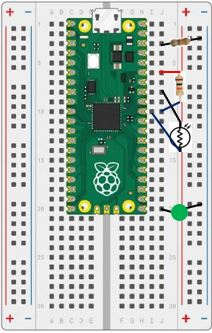
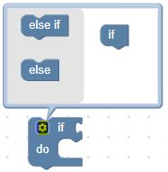
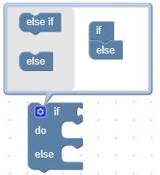

# Our Sixth Lab: Using a Photo Resistor 

## Parts for this Lab are as follows:

1. We need a single LED and resistor for this lab.  As a reminder for the setup:

    ```Insert the Anode(+) lead into j20```

    ```Insert the Cathode(-) lead into the Ground(-) rail```

    ```Insert the resistor leads into j3 and into the Ground(-) rail``` 

1. We will also use a resistor and a photo resistor.

    - Insert the pins of the resistor into ```j6 and j10```
    - Insert the pins of the photo resistor into ```j8 and i10``` 

1. When you are finished, your breadboard should look similar to the image below (Note: your LED and wires may be different colors)



## Building a Night Light With a Photo Resistor

- A photoresistor is a sensor that decreases resistance when light is shined on its surface. With no light a photoresistor has high resistance in the range of megaohms. As light shines on the surface the resistance drops to kiloohms. We can use this effect as a light sensor.

- To convert the variable resistance of a photoresistor to something we can measure with our microcontroller we will need to build a small circuit that includes a 10K ohm resistor. We then measure the voltage between the photoresistor and the 10K resistor as light falls on the sensor. The top and bottom of the circuit are tied to analog ground (AGND) and reference power(ADC_REF). This will move the voltage of the midpoint of the circuit.

- From our previous lab, we know that the microcontroller has the ability to convert an analog voltage (a voltage anywhere between 0 and ADC_REF volts) to a corresponding digital (0 to 65535) reading.  We can then use that reading to determine when to turn the LED on or off 

!!! Challenge

    Use the readings from the analog to digital converter pin to determine when to turn the LED on and off.

    Hints: 
    
    - You'll need to test the reading from the ADC block with an if else Logic block.  You can start with an if Logic block, then add the else by clicking on the gear and draging the else section over as follows:

    

    - If the ADC reading is over the mid-point of an ADC reading, turn the LED on, else turn it off

    You may need a bright overhead light to see a change in resistance as you cover and uncover the photo resistor.


     