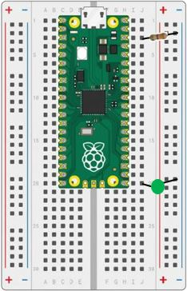
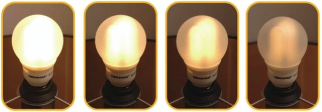
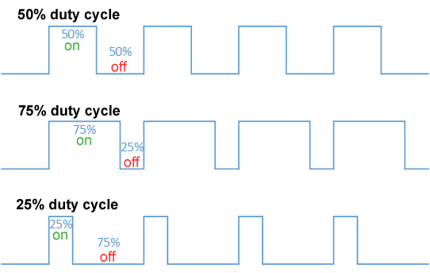
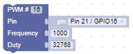
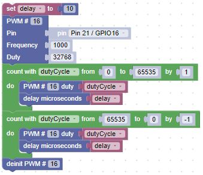

# Our Fourth Lab: Using Pulse Width Modulation (PWM) to Dim an LED

## Parts for this Lab are in Bag **2**

1. We only need a single LED for this lab.  As a reminder for the setup:

    ```Insert the Anode(+) lead into j20```

    ```Insert the Cathode(-) lead into the Ground(-) rail```

    ```Insert the resistor leads into j3 and into the Ground(-) rail``` 

1. When you are finished, your breadboard should look similar to the image below (Note: your LED may be a different color)



## What is Pulse Width Modulation (PWM)?

The object of this lab is to have the external LED start out on.  Then, slowly dim the LED.  Once the LED is off, slowly bring it back to full brightness.  Continue until you stop the program.



- We used a switch in the previous labs to turn an LED on and off, but what if we wanted to dim the LED?  Since we can’t control the voltage through the output pin blocks of our device, we have to use PWM.  PWM means that we will quickly vary the amount of time (duty cycle) that the voltage is applied to the LED.



## PWM - How Does It Work?

- PWM is controlled by two factors:
    - How fast does the power turn on and off (frequency)
    - How long is the power on, relative to the power being off (duty cycle)

- We can declare that an output pin block is used as a PWM output pin block using the following block from Machine In/Out Pins:

    

- This block will set the frequency such that it applies power 1000 times/second (to fast to see) and the duty cycle such that the power is on 50% of the time.  The duty cycle has a range of 0 to 65536.

- Now that we understand PWM, we can create a set of blocks that starts with the LED off, slowly brings the LED to full brightness, and then slowly back to off.

    

!!! Challenge

    Once that works, what happens if we repeat the exercise, starting with a frequency of 1000, and reduce the frequency to 10?  Use a list block with values: 1000, 500, 100, 50, 40, 30, 20, & 10. 

     