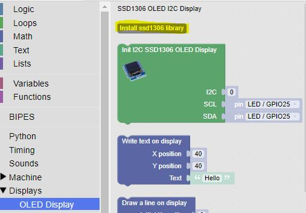
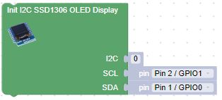
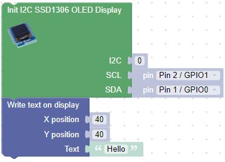

# Our Eigth Lab: Using an OLED Digital Display 

## We will use the SSD1306 OLED display in this lab.

 1. Insert the display into ```f25, f26, f27, and f28```

1. Using one of the jumper wires in Bag 8, insert one end to ```i25``` and the other end into ```i18```

1. Using another jumper wire from Bag 8, insert one end to ```j26``` and the other end into ```j5```

1. Using another jumper wire from Bag 8, insert one end to ```h27``` and the other end into ```b2```

1. Using another jumper wire from Bag 8, insert one end to ```i28``` and the other end into ```a1```

1. When you are finished, your breadboard should look similar to the image below (Note: your wires may be different colors)


## Working With the SSD1306 Display

- We'll need to add the SSD1306 Library to our microcontroller.  This can be done through the Install ssd1306 library button in the Display OLED Display section:

    

- Our display uses an Inter-Integrated Circuit (I2C) interface.  The I2C interface was first developed by Phillips Semiconductor in 1982 to facilitate serial communication between devices.

- Initialize the display with the Init I2C SSDD1306 OLED Display block, taking care to set I2C to 0, SCL to Pin 2, and SDA to Pin 1.

    

- Now we can write "Hello" to the display with the Write text on display block

    

!!! Challenge

    - Start by writing your name to the display at the top left corner (0, 0).

    - Pause for 1 second

    - Clear the screen (use the Clear OLED Display block)

    - Move your name down and to the right

    - Pause again

    - Continue moving down and to the right until you get to the bottom or the right edge of the screen. 

     