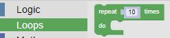
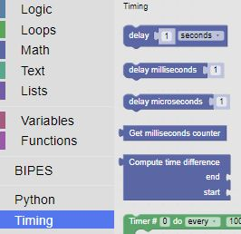

# Our First Lab: Making the Onboard LED Blink

## Selecting the Blocks

We'll need a few simple blocks to blink the onboard LED.  We'll want to turn on and off the LED using the following blocks:

- Loops
    - repeat 10 times

- Machine
    - In/Out Pins
        - set output pin

- Timing
    - delay 1 seconds

## Blocks on the Canvas

Once the blocks are selected and placed on the canvas, we'll have to change the second set output pin block so that it turns off the led (setting the pin to false).  We'll also add a second delay block, so we have some time between turning off the led and turning it back on.

We can execute our blocks by clicking on the angle in the circle next to the microcontroller 

## Adding a variable 

Next, we can add a variable block, so we can easily change the delay timing.  We add a single variable and use it in both delay blocks.

- Variables
    - Create variable...

- Click on Create variable... to create a variable and click on ok

- Now the variable is availble for use

- We'll need to set the delay to a number by using a Math number block

- Drag the number block to the delay block and set it to 0.5

- Now we can get our delay block from the Variables area and insert it into our delay blocks on the canvas.

!!! Challenge
    What is the fastest you can make the LED blink and still see it changing?  What does this tell you about the human eye?