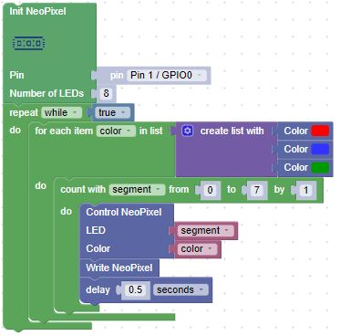
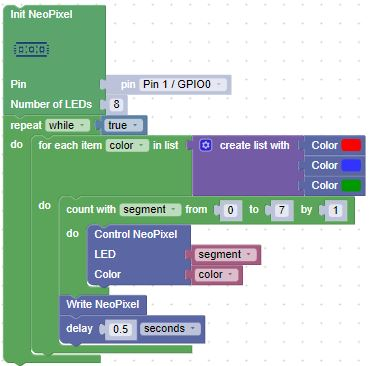

# Our Seventh Lab: Using a NeoPixel Display

## Solution 1: Setting colors one at a time

## Solution 2: Setting colors at the same time

Did you notice the subtle difference between the solutions?  

- In the first solution, we used the Write NeoPixel block each time a segment was set in the Control NeoPixel block.  

- In the second solution, we used the Write NeoPixel block only after all the segments were set in the Control NeoPixel block.